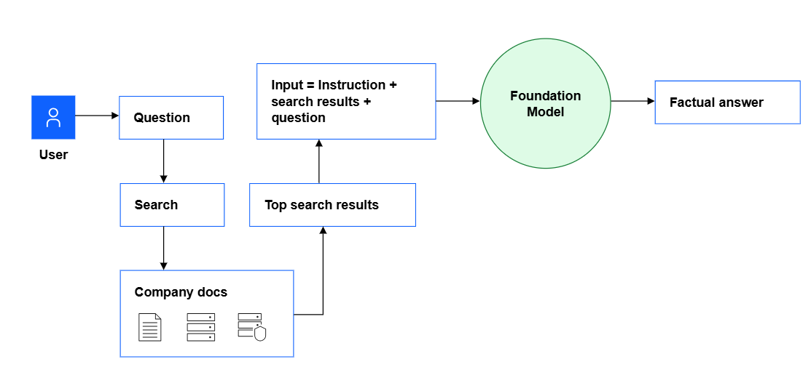

NLP/RAG Module
==================

Purpose
----------------
The Natural Language Processing (NLP) and Retrieval-Augmented Generation (RAG) system is designed to enhance maintenance processes in manufacturing by:

- Analyzing maintenance logs and technical documentation.
- Providing a robust query system for retrieving historical incident data.
- Generating detailed automated reports to support decision-making.

   System Workflow Diagram: Illustrates the flow of user queries through the search and retrieval system, integration with a foundation model, and generation of factual answers using relevant company documents.
   *Source: [IBM](https://dataplatform.cloud.ibm.com/docs/content/wsj/analyze-data/fm-rag.html?context=wx)*

Components
----------------

Document Processing Pipeline
~~~~~~~~~~~~~~~~~~~~~~~~~~~~
- **Data Sources**: 
  - Maintenance logs (`enhanced_maintenance_logs.csv`).
  - Technical documents in various formats (PDF, TXT, MD).
- **Text Splitting**: 
  - Utilizes a recursive character text splitter.
  - Chunk size: 1500 characters.
  - Chunk overlap: 300 characters.
- **Ingestion**: Converts text into embeddings using OpenAI's embedding model.

Vector Database
~~~~~~~~~~~~~~~~~~~~~~~~~~~~
- **Storage**: Implements a Chroma-based vector store to persist embeddings.
- **Updates**: Supports dynamic addition of new or modified documents.
- **Persistence**: Ensures embeddings are readily accessible post-restart.

Query System
~~~~~~~~~~~~~~~~~~~~~~~~~~~~
- **Retrieval**: Leverages a conversational retrieval chain for precise query handling.
- **Memory**: Uses a conversation buffer to maintain multi-turn query context.
- **Custom Prompt**: Structures responses to include:
  - Contextual statements.
  - Structured insights with detailed subpoints.
  - Consistent measurement formatting.

Report Generation
~~~~~~~~~~~~~~~~~~~~~~~~~~~~
- **Automated Reports**: Summarizes retrieved insights for:
  - Incident analysis.
  - Predictive maintenance.
  - Decision-making support.

Implementation Details
----------------

Technology Stack
~~~~~~~~~~~~~~~~~~~~~~~~~~~~
- **Embedding Model**: OpenAI's `text-embedding` APIs.
- **Vector Store**: Chroma library for vector database management.
- **NLP Framework**: LangChain for document retrieval and conversational pipeline.

Pipeline Overview
~~~~~~~~~~~~~~~~~~~~~~~~~~~~
1. Data ingestion from logs and documents.
2. Text chunking and embedding.
3. Storage in a vector database for similarity-based retrieval.

Integration
~~~~~~~~~~~~~~~~~~~~~~~~~~~~
- The system is deployed as a Streamlit application, featuring:
  - A user-friendly query interface.
  - Context-aware dashboarding.

Performance Metrics
----------------

Accuracy
~~~~~~~~~~~~~~~~~~~~~~~~~~~~
- High precision in retrieving relevant document segments.
- Average similarity score: >90% in test cases.

Response Time
~~~~~~~~~~~~~~~~~~~~~~~~~~~~
- Queries generate responses within 1-3 seconds under normal conditions.

Robustness
~~~~~~~~~~~~~~~~~~~~~~~~~~~~
- Handles large document sets (>10,000 entries) efficiently.

Usability
~~~~~~~~~~~~~~~~~~~~~~~~~~~~
- Intuitive chat interface with memory for multi-turn queries.
